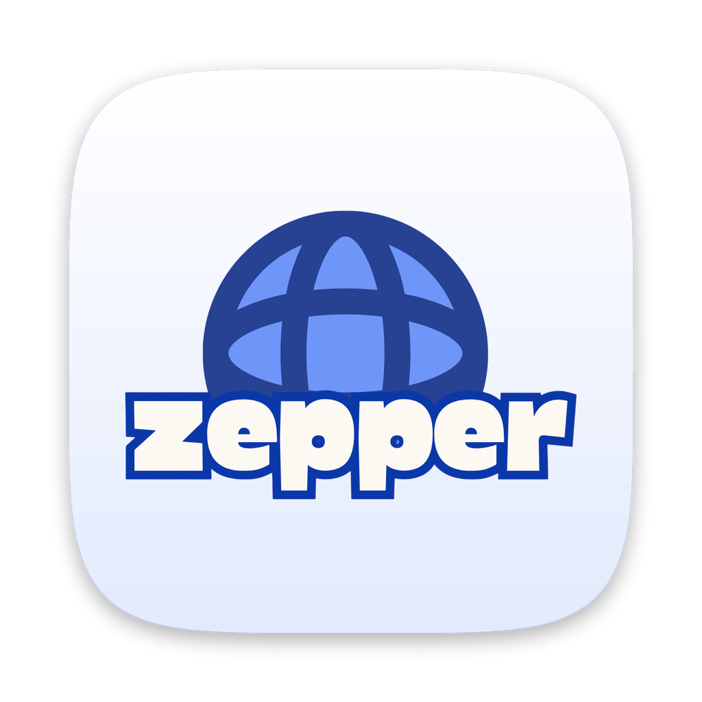
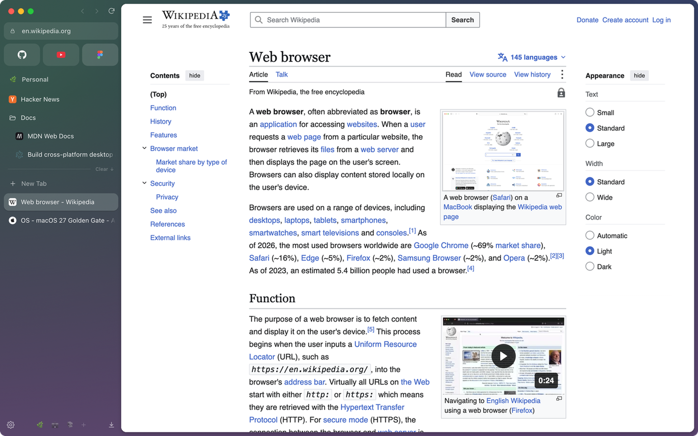

<div align="center">



# Zepper

**A private browser for macOS that you can make your own.**

Spaces, a vertical sidebar and Brave-grade privacy, built with TypeScript and React on Electron.<br>
Fork it, change anything, and see it in a second. No Chromium to compile.

[](LICENSE)
[](#getting-started)
[](https://www.electronjs.org/)
[](https://www.typescriptlang.org/)
[](https://github.com/imdewan/zepper-browser/actions/workflows/ci.yml)
[](CONTRIBUTING.md)

[Website](https://mrdsa.dev/zepper) · [Download](#download) · [Features](#features) · [Make it yours](#make-it-yours) · [Getting started](#getting-started) · [Docs](#documentation) · [Contributing](#contributing)

<br>



</div>

<br>

## Download

**[Download Zepper for Mac at mrdsa.dev/zepper](https://mrdsa.dev/zepper)** (Apple silicon, macOS 14 or later). The `.dmg` is also on the [latest release](https://github.com/imdewan/zepper-browser/releases/latest).

1. Open the `.dmg` and drag Zepper into Applications.
2. Zepper isn't notarized by Apple yet, so macOS blocks it the first time you open it. Go to **System Settings › Privacy & Security**, scroll down and click **Open Anyway**. You only need to do this once.

A short setup on first launch brings over your history and passwords from the browser you use now.

## Why Zepper

<table>
<tr>
<td width="33%" valign="top">

### 🗂️ Built around tabs

Spaces for each part of your life, a vertical sidebar with Essentials, pinned tabs and nested folders, and split view for up to four pages.

</td>
<td width="33%" valign="top">

### 🛡️ Private by default

Ads, trackers and cookie banners blocked. Fingerprinting noise, cross-site cookie blocking, HTTPS upgrades and clean links, all on out of the box.

</td>
<td width="33%" valign="top">

### 🛠️ Yours to change

The whole UI is React and CSS. Fork it, restyle it, add features. Hot reload shows changes instantly; Chromium comes prebuilt.

</td>
</tr>
</table>

## Features

**Spaces.** Group tabs into spaces, each with its own gradient theme (subtle or vivid) and, optionally, its own sign-ins: cookies, logins and site data kept apart like separate profiles. Swipe between spaces on the trackpad or pick one from the sidebar.

**A sidebar built for tabs.**

- **Essentials:** a grid of your most-used sites for each space, signed in with that space's accounts.
- **Pinned tabs** per space that survive restarts, organised in nestable **folders**.
- **Drag and drop** for everything: reorder, pin, add to Essentials, move to another space.
- **Split view:** up to four tabs side by side, stacked or in a grid.
- **Compact mode** hides the sidebar until you reach for the window edge.

**Command bar.** ⌘T to search, enter an address or jump to an open tab. DuckDuckGo bangs (`!yt cats`, `!gh electron`) resolve locally, so they go straight to the site.

**Privacy, the way it should be.** Every protection is on by default and can be switched off for one site from the lock icon.

| Protection                 | What it does                                                       |
| -------------------------- | ------------------------------------------------------------------ |
| Ad and tracker blocking    | uBlock Origin's filter lists, including YouTube ads                |
| Cookie banners hidden      | uBlock Origin's annoyance lists                                    |
| Fingerprinting protection  | Per-site noise on canvas, WebGL and audio; no local IP leaks       |
| Cross-site cookies blocked | Embedded third parties can't set or read cookies                   |
| HTTPS upgrades             | Plain-HTTP pages load over HTTPS when the site supports it         |
| Clean links                | Click identifiers (fbclid, gclid…) and Google AMP wrappers removed |
| Secure DNS                 | DNS over HTTPS, automatic or through Cloudflare, Quad9 or Google   |
| Global Privacy Control     | Asks sites not to sell or share your data                          |
| Private windows            | A throwaway session that leaves nothing behind                     |

**Apple Intelligence, on your Mac.** Nothing leaves your computer.

- **Summarise or ask the page:** a summary as soon as you open the panel (⇧⌘A), then answers to your questions about the page.
- **Translate pages** in place, keeping links and formatting.
- **Search history by meaning:** describe what you remember ("that article about async Rust") and find it.
- **Tidy Tabs** sorts a messy space into named folders.
- **Tabs you haven't opened lately** get a gentle nudge to close or file them.

**A password manager, built in.** Saved logins under sign-in fields, strong passwords for new accounts, and passkeys with Touch ID, all kept encrypted on your Mac. Import from Chrome, Brave, Edge, Arc and others in one click, or from Apple Passwords, Firefox, 1Password and Bitwarden exports.

**Arc-style captures.** ⇧⌘2: click an element, drag a region, or take the visible screen or the whole page. It's copied straight away, with a thumbnail you can drag into other apps.

**Media.** A now-playing card for audio in other tabs, automatic picture-in-picture when you leave a playing video, and optional Google Widevine for Netflix and other streaming services.

**Moving in is easy.** A short setup on first launch brings over your history and passwords from Chrome, Brave, Arc, Firefox, Safari and others.

**Everything you expect from a browser.** Automatic updates, Chrome-style screen sharing with tab or system audio, default browser support, Chrome Web Store extensions, downloads and history, Print, Save Page As and Export as PDF, a built-in PDF viewer, per-site zoom, find in page, certificate details and site permissions, and trackpad swipes to go back and forward.

See the [full feature list](docs/FEATURES.md).

## Make it yours

Most browsers you'd want to customise are Chromium forks. Changing them means downloading tens of gigabytes of source, compiling for hours, and rebasing your patches every few weeks.

Zepper is different. Chromium comes prebuilt with Electron, and everything you see (the sidebar, command bar, settings, themes) is TypeScript, React and CSS. A fresh fork runs in a couple of minutes, and UI changes appear as soon as you save.

```bash
# Fork on GitHub, then:
git clone https://github.com/<you>/zepper-browser.git
cd zepper-browser
npm install
npm run dev
```

Some ideas for your fork:

- **Rebrand it** with your own name, icon and colours.
- **Change the defaults:** search engine, theme presets, first space, settings.
- **Reshape the sidebar** or add buttons, panels and shortcuts.
- **Bring your own filter lists** or tune the privacy protections.

[docs/CUSTOMIZING.md](docs/CUSTOMIZING.md) maps out where everything lives, and how to add a command or a setting.

## Getting started

**Requirements:** macOS, [Node.js](https://nodejs.org/) 22 or later, npm 11. The Apple Intelligence helper needs Xcode 26 to build (optional; macOS 26 or later to run).

```bash
npm install
npm run dev
```

| Command                | What it does                                                                        |
| ---------------------- | ----------------------------------------------------------------------------------- |
| `npm run dev`          | Runs Zepper with hot reload for the UI                                              |
| `npm run check`        | Type-checks, lints and checks formatting                                            |
| `npm run build`        | Bundles main, preload and UI into `out/`                                            |
| `npm run dist`         | Builds the macOS app (`.dmg` and `.zip`, for Apple silicon and Intel) into `dist/`  |
| `npm run build:native` | Builds the native helpers (`native/`) for Apple silicon and Intel into `build/bin/` |
| `npm run brand:dev`    | Shows the development runtime as "Zepper" in the menu bar and Dock                  |

### Protected video (Widevine)

Zepper runs on [castLabs' Electron for Content Security](https://github.com/castlabs/electron-releases), which adds Google Widevine. It stays off until you turn it on in Settings → Media, or accept the prompt a site like Netflix shows. Installing it restarts Zepper once.

Streaming services also require the app to be **VMP-signed** with a production certificate from castLabs' free EVS service. One-time setup:

```bash
python3 -m venv .evs && .evs/bin/pip install castlabs-evs
npm run vmp:signup     # create your EVS account (it emails you a code)
npm run vmp:sign       # sign the development runtime
```

Run `npm run vmp:sign` again after reinstalling Electron, and `npm run vmp:login` when the login expires. `npm run dist` signs packaged builds for you.

### Signing releases

`npm run dist` signs the app with a code-signing certificate named **Zepper Signing** when your login keychain has one, so macOS sees every update as the same app and camera and microphone permissions carry over. The Keychain still asks once after each update: it remembers "Always Allow" by Apple developer team, which a self-signed certificate doesn't have, so it goes by the exact build instead (signing with an Apple Developer ID ends that). Without the certificate, builds are signed ad hoc and camera and microphone permissions are asked for again too. To make one: Keychain Access → Certificate Assistant → Create a Certificate…, with Identity Type **Self-Signed Root** and Certificate Type **Code Signing**. Every release has to be signed with the same certificate, so keep a backup of it (exported as a password-protected `.p12`). To use a different name, set `ZEPPER_SIGNING_IDENTITY`.

<details>
<summary><b>Keyboard shortcuts</b></summary>
<br>

| Action                                        | Keys                  |
| --------------------------------------------- | --------------------- |
| Command bar / new tab · open location         | ⌘T · ⌘L               |
| Close tab · close window · reopen closed tab  | ⌘W · ⇧⌘W · ⇧⌘T        |
| Recent tab · next / previous tab              | ⌃⇥ · ⌥⌘↓ / ⌥⌘↑        |
| Space 1–9 · next / previous space             | ⌃1…⌃9 · ⌥⌘→ / ⌥⌘←     |
| Essential 1–9 · tab 1–8 / last                | ⌥1…⌥9 · ⌘1…⌘8 / ⌘9    |
| Pin / unpin · clear unpinned tabs             | ⌘D · ⇧⌘K              |
| Compact mode · find in page                   | ⌘S · ⌘F               |
| Split side by side / stacked / grid · unsplit | ⌥⌘V / ⌥⌘H / ⌥⌘G · ⌥⌘U |
| Print · save page · open file · view source   | ⌘P · ⇧⌘S · ⌘O · ⌥⌘U   |
| History · downloads                           | ⌘Y · ⌥⌘L              |
| New window · new private window               | ⌘N · ⇧⌘N              |
| Copy URL · copy as Markdown                   | ⇧⌘C · ⌥⇧⌘C            |

</details>

## Documentation

|                                      |                                                      |
| ------------------------------------ | ---------------------------------------------------- |
| [Features](docs/FEATURES.md)         | Everything Zepper does, by area                      |
| [Architecture](docs/ARCHITECTURE.md) | How it's built: processes, layers, state, sessions   |
| [Customizing](docs/CUSTOMIZING.md)   | Where things live in your fork, and how to extend it |
| [Contributing](CONTRIBUTING.md)      | Setting up, making changes, pull requests            |
| [Security](SECURITY.md)              | Reporting vulnerabilities privately                  |

<details>
<summary><b>Project layout</b></summary>
<br>

| Path                        | What it is                                                                                                                           |
| --------------------------- | ------------------------------------------------------------------------------------------------------------------------------------ |
| `src/main/`                 | Main process: windows, spaces and tabs, sessions and profiles, privacy protections, extensions, downloads, persistence               |
| `src/preload/`              | `index.ts` bridges the UI to the main process; `page.ts` runs in every web page (cosmetic filtering, privacy shims, dialogs, swipes) |
| `src/renderer/src/chrome/`  | The sidebar, drawn under the web pages                                                                                               |
| `src/renderer/src/overlay/` | A transparent layer above the pages: command bar, popovers, settings, dialogs, history, downloads                                    |
| `src/renderer/src/pip/`     | Controls for the floating picture-in-picture player                                                                                  |
| `src/shared/`               | Types, settings and theme helpers shared by every process                                                                            |
| `native/zepper-ai/`         | A Swift helper for Apple's on-device models: summaries, answers, translation, embeddings, Tidy Tabs                                  |
| `scripts/`                  | Packaging hooks, icon and screenshot generators                                                                                      |

</details>

## Contributing

Bug reports, ideas and pull requests are welcome. Read [CONTRIBUTING.md](CONTRIBUTING.md) to get set up, and please follow the [Code of Conduct](CODE_OF_CONDUCT.md). Found a security problem? Report it privately, as described in [SECURITY.md](SECURITY.md).

## Acknowledgements

Zepper's sidebar-first design is inspired by [Zen Browser](https://zen-browser.app/). Go give it a try too.

Zepper stands on the shoulders of [Electron](https://www.electronjs.org/) and [Chromium](https://www.chromium.org/), [castLabs' Electron for Content Security](https://github.com/castlabs/electron-releases), [Ghostery's adblocker](https://github.com/ghostery/adblocker) with [uBlock Origin](https://github.com/uBlockOrigin/uAssets) and [EasyList](https://easylist.to/) filter lists, [electron-chrome-extensions](https://github.com/samuelmaddock/electron-browser-shell), [tldts](https://github.com/remusao/tldts), [React](https://react.dev/), [Motion](https://motion.dev/) and [DuckDuckGo's bangs](https://duckduckgo.com/bangs).

## License

Zepper is free software, licensed under the [GNU General Public License v3.0 only](LICENSE). You can use, study, change and share it; if you distribute a modified version, it has to stay under the same license, with its source available.

Copyright © 2026 Dewan Shakil. Third-party components keep their own licenses: Electron and Chromium (MIT and BSD-style), electron-chrome-extensions (GPL-3.0), Ghostery's adblocker (MPL-2.0), and the filter lists, which are downloaded at runtime under their own terms. Google Widevine is downloaded from Google only if you turn it on, under Google's terms.
